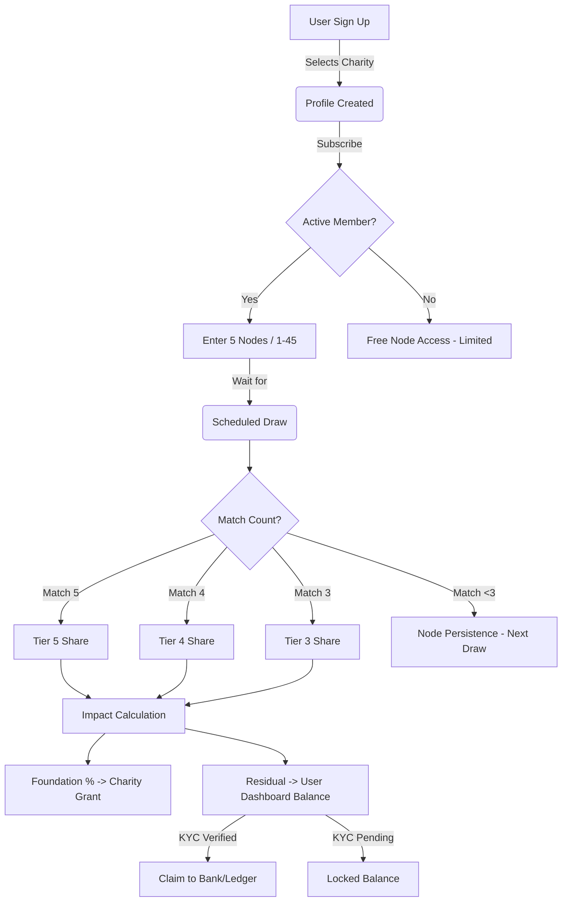

# Lumina: Global Philanthropic Network 🌍

Lumina is a premium, membership-only platform designed to bridge the gap between high-level philanthropy and dynamic prize distribution. By joining Lumina, members contribute to verified humanitarian foundations while participating in a strategic, algorithmic draw system.

---

## 🏛️ The Architecture

Lumina is built on a high-availability stack designed for transparency, security, and global scalability.

- **Frontend**: Next.js 14+ with App Router (React Server Components).
- **Styling**: Vanilla CSS with a focus on "Lumina Neo-Classical" aesthetics (glassmorphism, premium typography).
- **Backend & Database**: Supabase (PostgreSQL with Row Level Security).
- **Authentication**: Supabase Auth with custom user metadata and regional profiling.
- **Payments**: Stripe (Subscription-based and once-off prize pool contributions).
- **Storage**: Supabase Storage for secure KYC and humanitarian evidence.

---

## 🎮 Game Flow & Mechanisms

Lumina operates on a **Node-based Accumulation** model rather than traditional "gambling." 

### 1. Membership & Allocation
- **Join**: Members select a subscription tier (Monthly/Yearly/Free-Tier).
- **Foundation Choice**: Upon signing up, members choose a verified charity (e.g., WWF, Red Cross).
- **Impact Ratio**: Members set an "Impact Percentage" (10% - 50%). If they win a prize pool, this percentage is automatically diverted to their chosen charity before personal distribution.

### 2. Node Seeding (Participating)
- Each member maintains 5 active "Nodes" (numbers from 1 to 45).
- These nodes represent your participation in the next scheduled Draw.
- Nodes can be updated at any time until the **Score Cutoff** (usually 1 hour before the draw).

### 3. The Algorithm & Draw
Draws occur on a scheduled basis (simulated every Monday and Friday at UTC 00:00).

- **The Draw Engine**: 5 winning numbers are generated.
- **Verification**: The system benchmarks every member's active nodes against the winning sequence.
- **Tier Matching**:
  - **Tier 5 (Jackpot)**: Match 5 nodes. Shared across all T5 winners.
  - **Tier 4**: Match 4 nodes. 
  - **Tier 3**: Match 3 nodes.
- **Rollover logic**: If nobody matches a tier, that pool rolls over into the next draw, increasing the "Force Node" value.

### 4. Prize Redistribution Node (Winning)
When a win is triggered:
1. **Charitative Pivot**: The member's pre-set % (e.g. 20%) is calculated.
2. **The Grant**: That amount is registered as a "Philanthropic Grant" to the chosen charity.
3. **The Balance**: The remaining 80% is credited to the member's **Lumina Balance**.
4. **KYC & Settlement**: Members must verify their identity (KYC) to move funds from their internal balance to their external ledger/bank.

---

## 🗺️ Functional Flow Map



---

## 🛠️ Developer Setup

### Prerequisites
- Node.js (Latest LTS)
- Supabase Account
- Stripe API Keys

### Installation
1. **Clone the repository**:
   ```bash
   git clone [repository-url]
   cd GolfCharity
   ```

2. **Install dependencies**:
   ```bash
   npm install
   ```

3. **Configure Environment**:
   Copy `.env.example` to `.env.local` and populate:
   - `NEXT_PUBLIC_SUPABASE_URL`
   - `NEXT_PUBLIC_SUPABASE_ANON_KEY`
   - `SUPABASE_SERVICE_ROLE_KEY`
   - `STRIPE_SECRET_KEY`
   - `NEXT_PUBLIC_STRIPE_PUBLISHABLE_KEY`

4. **Initialize Database**:
   Execute the content of `schema.sql` in your Supabase SQL Editor.

5. **Run Development Server**:
   ```bash
   npm run dev
   ```

---

*Lumina - Directing global fortune toward humanitarian nodes.*
